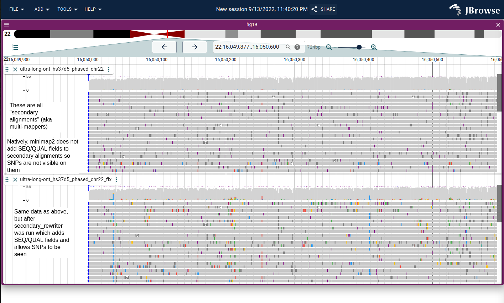
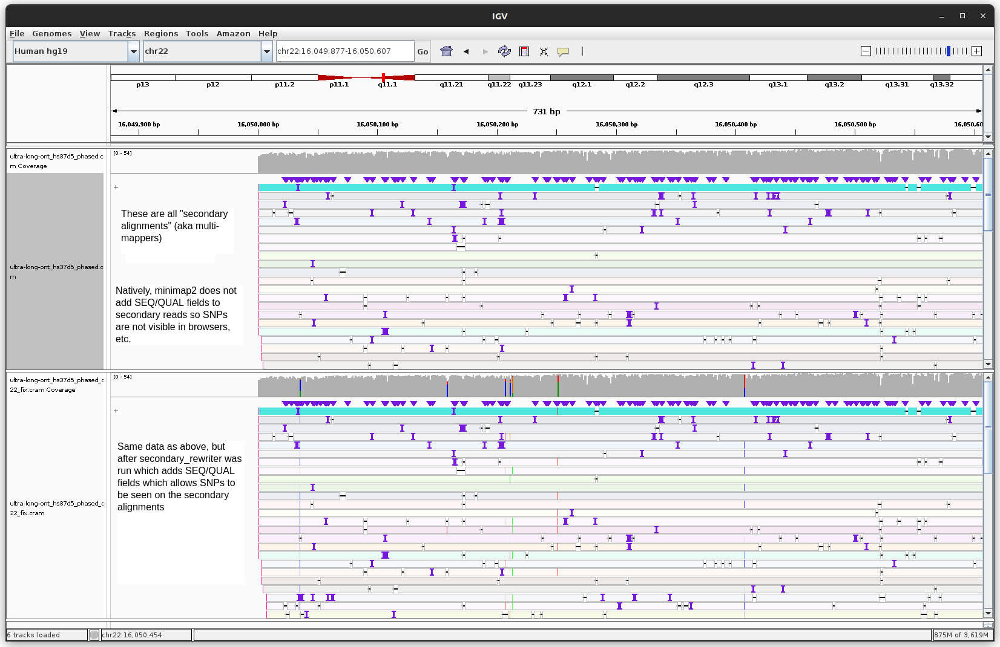

# secondary_rewriter

Some aligners such as minimap2 do not write the SEQ and QUAL fields to
secondary alignments (which are sometimes called multi-mappers, see Multiple
mapping in SAMv1.pdf https://samtools.github.io/hts-specs/SAMv1.pdf) making it
hard to analyze them (for example, SNPs will not be visible in a genome browser
for secondary alignments and variant calling would not work on them). This
program adds SEQ/QUAL to secondary alignments, referring to the primary
alignment to get the SEQ and QUAL.

Minimap2 reference https://github.com/lh3/minimap2/issues/458 https://github.com/lh3/minimap2/pull/687

## Install

First install rust, probably with rustup https://rustup.rs/

Then

```
cargo install secondary_rewriter
```

## Usage

This small shell script automates the multi-step pipeline (supports BAM or CRAM)

```

#!/bin/bash

# write_secondaries.sh
# usage
# ./write_secondaries.sh <input.cram> <ref.fa> <output.cram> <nthreads default 4> <memory gigabytes, per-thread, default 1G>
# e.g.
# ./write_secondaries.sh input.cram ref.fa output.cram 16 2G

THR=${4:-4}
MEM=${5:-1G}


samtools view -@$THR -h $1 -T $2 -f256 > sec.txt
samtools view -@$THR -h $1 -T $2 -F256 | secondary_rewriter --generate-primary-loc-tag --secondaries sec.txt | samtools sort --reference $2 -@$THR -m $MEM - -o $3

```

## Two-pass strategy

The two-pass strategy works as follows

1. First pass: output ALL secondary alignments (reads with flag 256) to a
   external file
2. Second pass: read secondary alignments from external file into memory,
   and then scan original SAM/BAM/CRAM to add SEQ and QUAL fields on the
   primary alignments to the secondary alignments, and pipe to `samtools sort`
   (needed because all the secondary reads will be out of order, added right
   after the primary alignment where the SEQ/QUAL is found)

This process avoids loading the entire SAM/BAM/CRAM into memory, but does
require the `samtools sort` which is a bit expensive. It does load all the
secondary alignments (pre-them-having SEQ/QUAL fields which is generally on the
order of a couple gigabytes instead of hundred(s) of gigabytes) into memory
though.

## Result

Your secondary reads will now display with SNPs and such in a genome browser.
Having SEQ is also important for variant calling.

Screenshots from both IGV and JBrowse 2 (just to show it's not browser
specific) showing the same file before and after calling with
`secondary_rewriter` on a region of the genome with many secondary alignments
in a centromeric region (ultra long read hs37d5 from
https://ftp-trace.ncbi.nlm.nih.gov/ReferenceSamples/giab/data/AshkenazimTrio/HG002_NA24385_son/Ultralong_OxfordNanopore/guppy-V2.3.4_2019-06-26/


Screenshot of before/after running secondary_rewriter in JBrowse 2


Screenshot of same data, before/after, in IGV

## Help

```

secondary_rewriter 0.1.9
Adds SEQ and QUAL fields to secondary alignments from the primary alignment

USAGE:
    secondary_rewriter [OPTIONS]

OPTIONS:
    -g, --generate-primary-loc-tag     Boolean flag on whether to produce a tag like pl:Z:chr1:1000
                                       on the secondary alignments that says where the primary
                                       alignment is
    -h, --help                         Print help information
    -s, --secondaries <SECONDARIES>    Path to file of secondary reads (generated by e.g. samtools
                                       view -f256)
    -V, --version                      Print version information

```

`--generate-primary-loc-tag` creates a tag on the secondary reads like
pl:Z:chr1:1000 to say where the primary read is

## Runtime

The speed of this program is mostly limited by samtools view/samtools sort
efficiency, so if you give samtools tons of threads and memory your performance
will improve.

On a t2.2xlarge AWS instance it took 189 minutes (~3 hours) with 8 threads and
1GB per-thread sorting memory to run secondary_rewriter on a 218 gigabyte BAM
file (ultra long read hs37d5 from
https://ftp-trace.ncbi.nlm.nih.gov/ReferenceSamples/giab/data/AshkenazimTrio/HG002_NA24385_son/Ultralong_OxfordNanopore/guppy-V2.3.4_2019-06-26/)

Note also that the output data file is larger, in this example the result was
267Gb BAM vs the original 218Gb BAM.

## Possible consideration

- There are reasons that minimap2 may not output these fields (size of output
  being cited by the author), but it is perfectly possible to add the SEQ and
  QUAL back. This PR to minimap2 natively outputs the SEQ and QUAL
  https://github.com/lh3/minimap2/pull/687/files but it has been stated that
  minimap2 "will not" output these.

- This program does not handle hard clipping in the CIGAR (`H` operator) but I
  haven't seen minimap2 output yet. If you see this let me know and a fix can
  probably be made.

- Finally, you may also want to think about the implications of how to treat
  secondary alignments in your pipeline, for while this program can help in
  this particular circumstance, it may be unclear what the implications of
  these secondary/multi-mapping alignments are.
